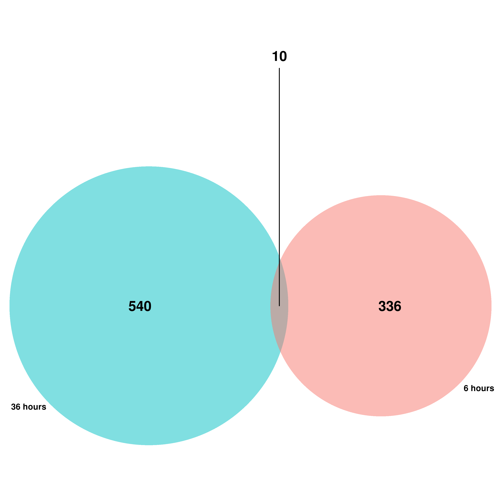

```{r message=FALSE}
# Core tidyverse packages
library(tidyverse)      # ggplot2, dplyr, tidyr, readr, etc.
library(ggplot2)        # plotting
library(scales)         # comma formatting, hue_pal()

# Color palettes
#library(RColorBrewer)

# Bioconductor core packages
library(DESeq2)
library(SummarizedExperiment)
library(BiocGenerics)
library(S4Vectors)
library(IRanges)

# Data reshaping
#library(reshape2)
library(tidyr)
library(dplyr)

## The affy library has a density plotting function
library(affy)

library(pheatmap)
library(PoiClaClu)
```

# Exploratory Data Analysis

## Loading data into R

```{r}
data6 <- read.table("./data/GSE268987_LF_6vsC_6_deg.txt", sep = "\t", quote = "", header = T)

control_6 <- data6[28:31] 
names(control_6) <- c("C6_r1", "C6_r2", "C6_r3", "C6_r4")

exposed_6 <- data6[24:27]  
names(exposed_6) <- c("E6_r1", "E6_r2", "E6_r3", "E6_r4")

data_6 <- data.frame(control_6, exposed_6)
rownames(data_6) <- data6[, 1]

head(data_6)
```

```{r}
data36 <- read.table("./data/GSE268987_LF_48vsC_48_deg.txt", sep = "\t", quote = "", header = T)

control_36 <- data36[28:31] 
names(control_36) <- c( "C36_r1", "C36_r2", "C36_r3", "C36_r4")

exposed_36 <- data36[24:27] 
names(exposed_36) <- c( "E36_r1", "E36_r2", "E36_r3", "E36_r4")

data_36 <- data.frame(control_36, exposed_36)
rownames(data_36) <- data36[, 1]

head(data_36)
```

## Visualizing using `boxplot` and `density plot`

### Statistics

```{r}
summary(data_6)
```

```{r}
summary(data_36)
```

The data has a large range with the maximum and average values being very far apart. This will create a lot of outliers in the plot which will be interesting later on.

### Boxplots

```{r}
BoxPlotRawCount <- function(data, label) {
  # Convert to long format
  long_df <- pivot_longer(data,
      cols = everything(),
      names_to = "sample",
      values_to = "value"
    )
  
  myColors <- hue_pal()(2)
  
  ggplot(long_df, aes(x = sample, y = value+1)) + # add 1 to solve log (0) values
  geom_boxplot(col=rep(myColors, each=4)) +
  scale_y_continuous(trans = "log2") +
  labs(
    title = paste("Box Plot of Raw Counts (log₂ scale) for", label, "hours experiment"),
    x = "Sample",
    y = "Counts (log₂)"
  ) +
  theme_minimal() +
  theme(axis.text.x = element_text(angle = 45, hjust = 1))
}
```

```{r}
#Boxplot 6 hours
BoxPlotRawCount(data_6, "6")
#Boxplot 36 hours
BoxPlotRawCount(data_36, "36")
```

The sample E6_r3 has the highest counts compared with other samples.

### Barplots

```{r}
  myColors <- hue_pal()(2)

BarPlotRawCount <- function(data, label) {
  
  # Convert to long format
  long_df <- pivot_longer(data,
      cols = everything(),
      names_to = "sample",
      values_to = "value"
    )
  
ggplot(long_df, aes(x = sample, y = value/10^6)) +
  stat_summary(
    fun = sum, 
    geom = "col", 
    fill =rep(myColors, each=4)

  )  +
  scale_y_continuous(labels = scales::comma)  +
    theme_minimal()

  
  ggplot(long_df, aes(x = sample, y = value/10^6)) +
    stat_summary(
      fun = sum, 
      geom = "col", 
      fill =rep(myColors, each=4)
    )  +
    scale_y_continuous(labels = scales::comma) +
    labs(
      title = paste("Bar Plot of Raw Counts (/10^6) for ", label, "hours experiment"),
      x = "Sample",
      y = "Counts (/10^6)"
    ) +
    theme_minimal()
}
```

```{r}
#Barplot 6 hours
#BarPlotRawCount(data_6, "6")
#Barplot 36 hours
#BarPlotRawCount(data_36, "36")
```
Again we observe E6_r3 to have the highest count. Notably E6_r1 has a lower count compared to it's replicates.

### Density plots

```{r}
DensityPlotRawCount <- function(data) {
  ## Create a list of 4 colors to use which are the same used throughout this chapter 
  myColors <- hue_pal()(2)
  
  ## Plot the log2-transformed data with a 0.1 pseudocount
  plotDensity(log2(data + 0.1), col=rep(myColors, each=4),
              lty=c(1:ncol(data)), xlab='Log2(count)',
              main='Expression Distribution')
  
  ## Add a legend and vertical line
  legend('topright', names(data), lty=c(1:ncol(data)),
         col=rep(myColors, each=4))
  abline(v=-1.5, lwd=1, col='red', lty=2)
}
```

```{r}
#Density Plot 6 hours
DensityPlotRawCount(data_6)
#Density Plot 36 hours
DensityPlotRawCount(data_36)
```

After analyzing the above plots, two samples appear irregular: E6_r3 from the 6-hour dataset (though its impact is minimal) and C36_r1 from the 36-hour dataset. This is observed in the disparity with their replicate samples in each of the graph's peaks. These will be noted for potential removal in the final step of analysis.

## Visualizing using `heatmap` and `MDS`

This section adds a few Exploratory Data Analysis techniques where we will measure and look at distances between samples based on normalized data.

### Normalized Distance Heatmap

The updated values which are now comparable across genes whereas the raw count data was harder to compare.

```{r}
VisualizeNormalizedDistanceHeatMap <- function(data, label) {
  ddsMat <- DESeqDataSetFromMatrix(countData = data,
                                  colData = data.frame(samples = names(data)),
                                  design = ~ 1)
  
  # Perform normalization
  rld.dds <- vst(ddsMat)
  # 'Extract' normalized values
  rld <- assay(rld.dds)
  
  sampleDist <- dist(t(rld))
  sampleDistMatrix <- as.matrix(sampleDist)

  annotation <- data.frame(Samples = factor(rep(1:2, each = 4), labels = c("CTROL", "FLX")))
  rownames(annotation) <- names(data)

  pheatmap(sampleDistMatrix,
           show_colnames = F,
           annotation_col = annotation,
           clustering_distance_rows = sampleDist,
           clustering_distance_cols = sampleDist,
           main = paste("Euclidean Sample Distances", label))
}
```

```{r}
#Normalized distance heat map 6 hours
VisualizeNormalizedDistanceHeatMap(data_6, "6 hours")
#Normalized distance heat map 36 hours
VisualizeNormalizedDistanceHeatMap(data_36, "36 hours")
```

Sample groups don't seem to be grouped at all. The most obvious disparity in distance comes from samples C36_r1 and E36_r3.

### Poisson Distance

```{r}
VisualizePoissonDistance <- function(data, label) {
  ddsMat <- DESeqDataSetFromMatrix(countData = data,
                                  colData = data.frame(samples = names(data)),
                                  design = ~ 1)
  
  #Poisson function already performs normalization
  posid <- PoissonDistance(t(assay(ddsMat)), type = "deseq")
  samplePoisDistMatrix <- as.matrix(posid$dd)
  mdsPoisData <- data.frame(cmdscale(samplePoisDistMatrix))
  names(mdsPoisData) <- c('x_coord', 'y_coord')
  
  groups <- factor(rep(1:2, each = 4), labels = c("CTROL", "FLX"))
  colData <- names(data)
  
  ggplot(mdsPoisData, aes(x = x_coord, y = y_coord, color = groups, label = colData)) + 
  geom_text(size = 4) +
  labs(title = paste("Multi Dimensional Scaling, Sample", label), x = "Poisson Distance", y = "Poisson Distance") +
  theme_bw()
}
```

```{r}
#Poisson Distance 6 hours
VisualizePoissonDistance(data_6, "6 hours")
#Poisson Distance 36 hours
VisualizePoissonDistance(data_36, "36 hours")
```

After generating heatmaps and MDS plots, the most irregular samples identified are: C36-R1 and E36_R3 from the 36-hour dataset, and C6_R4 from the 6-hour dataset.

## Clean data

The only clear rule is that each group must retain at least three samples. If one of the three samples visibly deviates from the other replicates, even after normalization, it will stay in your data set and it should be mentioned in your analysis report/ final article that noise may be introduced by this sample.

```{r}
data_6_clean <- select(data_6, -c("C6_r4")) # Removes C6_r4
data_36_clean <- select(data_36, -c("C36_r1", "E36_r3")) # Removes C36_r1 & E36_r3
```

# Discovering Differentialy Expressed Genes (DEGs)

## DESeq2

```{r}
DiscoverDEGsWithDESeq <- function(data, controlSamples, exposedSamples) {
  col <- data.frame(samples = names(data), group = factor(c(rep("control", controlSamples), rep("exposed", exposedSamples)), labels = c("control", "exposed")))
  
  dds <- DESeqDataSetFromMatrix(countData = data,
                                    colData = col,
                                    design = ~ group)
  dds <- DESeq(dds)
  
  res <- results(dds)
  res <- results(dds, name="group_exposed_vs_control")
  resLFC <- lfcShrink(dds, coef="group_exposed_vs_control", type="apeglm")
  
  return(list(deg = res, deg_lfcShrink = resLFC))
}
```

```{r message=FALSE, warning=FALSE}
#Differential expressed genes 6 hours
deg_6 <- DiscoverDEGsWithDESeq(data_6_clean, 3, 4)
```
```{r}
summary(deg_6$deg)
```

```{r message=FALSE, warning=FALSE}
#Differential expressed genes 36 hours
deg_36 <- DiscoverDEGsWithDESeq(data_36_clean, 3, 3)
```
```{r}
summary(deg_36$deg)
```

## MA Plot

In DESeq2, the function plotMA shows the log2 fold changes attributable to a given variable over the mean of normalized counts for all the samples in the DESeqDataSet. Points will be colored blue if the adjusted p value is less than 0.1. Points which fall out of the window are plotted as open triangles pointing either up or down.

Log fold change shrinkage for visualization and ranking:

“It is more useful visualize the MA-plot for the shrunken log2 fold changes, which remove the noise associated with log2 fold changes from low count genes without requiring arbitrary filtering thresholds.”

```{r message=FALSE, warning=FALSE}
#Plot LFC 6 hours
plotMA(deg_6$deg_lfcShrink)
#Plot LFC 36 hours
plotMA(deg_36$deg_lfcShrink)
```

## Unadjusted P-values

It seems no p-adjusted value is significant enough, even after moving up to 0.1. We can plot the p-value distribution to see if we have some usable values.

```{r}
PlotPVal <- function(deg, label) {
  t <- data.frame(deg)
  t <- drop_na(t)
  
  ggplot(t, aes(x = round(pvalue, digits = 2))) +
    geom_bar() +
    geom_vline(xintercept = 0.05, colour = "red") +
    labs(title = paste("Rounded PValue Distribution", label, "0.05 cutoff"))
}
```

```{r}
#pvalue plot 6 hours
PlotPVal(deg_6$deg, "6 hours")
#pvalue plot 36 hours
PlotPVal(deg_36$deg, "36 hours")
```

```{r}
FilterDEGs <- function(deg) {
  s <- data.frame(deg)
  return(filter(s , pvalue < 0.05))
}
```

```{r}
#Filtered DEGs 6 hours
deg_6_filtered <- FilterDEGs(deg_6$deg)
nrow(deg_6_filtered)
#Filtered DEGs 36 hours
deg_36_filtered <- FilterDEGs(deg_36$deg)
nrow(deg_36_filtered)
```

After using unadjusted p-values we get a similar result as in the scientific paper. The values would be exact without removing the replicate samples in the cleaning step. In order to show results we will proceed with unadjusted p-values. Of course with the disclaimer that we are working with unadjusted p-values.

## Volcano Plot

```{r include=FALSE}
if (!require("EnhancedVolcano"))
  BiocManager::install("EnhancedVolcano")
```

```{r message=FALSE}
library(EnhancedVolcano)
```

```{r}
PlotEnhancedVolcano <- function(deg, geneNames, label, yCutoff) {
  EnhancedVolcano(deg, x = 'log2FoldChange', y = 'pvalue',
                   lab = geneNames,
                   title = paste("DEGs sample", label),
                   subtitle = bquote(italic('')),
                   # Change text and icon sizes
                   labSize = 3, pointSize = 1.5, axisLabSize=10, titleLabSize=12,
                   subtitleLabSize=8, captionLabSize=10,
                   # Disable legend
                   legendPosition = "none",
                   # Set cutoffs
                   ylim = c(0, yCutoff),
                   pCutoff = 0.05, FCcutoff = 0)
}
```

```{r warning=FALSE}
GetGeneNames <- function(deg, data) {
  geneNames <- c()
  for (ensId in rownames(data.frame(deg))) {
    row <- data[which(data$gene_id == ensId), ]
    geneNames <- c(geneNames, row$gene_name)
  }
  return(geneNames)
}
```

```{r warning=FALSE}
#Volcano Plot 6 hours
PlotEnhancedVolcano(deg_6$deg, GetGeneNames(deg_6$deg, data6), "6 hours", 4)
#Volcano Plot 36 hours
PlotEnhancedVolcano(deg_36$deg, GetGeneNames(deg_36$deg, data36), "36 hours", 10.5)
```

## Venn Diagram

```{r message=FALSE}
library(VennDiagram)
```

```{r message=FALSE, warning=FALSE}
futile.logger::flog.threshold(futile.logger::ERROR, name = "VennDiagramLogger")
venn.diagram(
  x = list(rownames(deg_6_filtered), rownames(deg_36_filtered)),
  category.names = c("6 hours", "36 hours"),
  filename = "6h_vs_36h_venn_diagram.png",
  imagetype = "png",
  output=TRUE,
  
  # Circles
  lwd = 2,
  lty = 'blank',
  fill = myColors,
  
  # Numbers
  fontface = "bold",
  fontfamily = "sans",
  
  # Set names
  cat.cex = 0.6,
  cat.fontface = "bold",
  cat.fontfamily = "sans"
)
```



## Enrichment Analysis

```{r eval=FALSE, include=FALSE}
if (!(require("ReactomePA"))) {
  options(repos = c(  PPM = "https://packagemanager.posit.co/cran/__linux__/jammy/latest",   CRAN = "https://cloud.r-project.org"))
  pak::pkg_install(c("gdtools", "systemfonts","igraph","clusterProfiler"))
  
  BiocManager::install("reactome.db")
  
  BiocManager::install(c("clusterProfiler", "org.Hs.eg.db"))
  
  BiocManager::install("ReactomePA")
}
```

```{r message=FALSE, warning=FALSE}
library(org.Hs.eg.db)
library(clusterProfiler)
library(ReactomePA)
```

**What biological activities are my genes collectively involved in?**

This tells you the functional themes of your gene list at a more granular level than KEGG — helping you understand not just which pathways, but what processes (cell division, metabolism, signaling, etc.) your genes are driving.

```{r}
GoEnrichmentAnalysis <- function(group_genes, pval, ont) {
  go_results <- enrichGO(gene          = group_genes$ENTREZID,
                       OrgDb         = org.Hs.eg.db,
                       keyType       = 'ENTREZID', # or 'SYMBOL'
                       ont           = ont,
                       pAdjustMethod = "none",
                       pvalueCutoff  = pval,
                       qvalueCutoff  = 1,
                       readable      = TRUE)

  return(go_results)
}
```

**Given my list of genes, which biological processes/pathways are they most likely involved in?**

```{r}
KeggEnrichmentAnalysis <- function(group_genes, pval) {
  kegg_results <- enrichKEGG(gene = group_genes$ENTREZID,
                             organism = "hsa",
                             keyType = "kegg",
                             pvalueCutoff = pval,
                             pAdjustMethod = "none",
                             minGSSize = 10,
                             maxGSSize = 500,
                             qvalueCutoff = 1,
                             use_internal_data = FALSE)
  
  return(kegg_results)
}
```

**At the most detailed molecular level, what exact reactions and sub-pathways are my genes involved in?**

```{r}
ReactomeEnrichmentAnalysis <- function(group_genes, pval) {
  ora_results <- enrichPathway(gene = group_genes$ENTREZID, 
                               organism = "human",
                               pvalueCutoff = pval,
                               pAdjustMethod = "none",
                               qvalueCutoff = 1)
  
  return(ora_results)
}
```

```{r warning=FALSE}
#Enrichment Analysis 6 hours
genes_6 <- bitr(row.names(deg_6_filtered), fromType = "ENSEMBL", toType = "ENTREZID", OrgDb="org.Hs.eg.db")
dotplot(GoEnrichmentAnalysis(genes_6, 0.05, "BP"))
dotplot(GoEnrichmentAnalysis(genes_6, 0.05, "CC"))
dotplot(GoEnrichmentAnalysis(genes_6, 0.05, "MF"))
dotplot(KeggEnrichmentAnalysis(genes_6, 0.05))
dotplot(ReactomeEnrichmentAnalysis(genes_6, 0.05))
```

```{r warning=FALSE}
#Enrichment Analysis 36 hours
genes_36 <- bitr(row.names(deg_36_filtered), fromType = "ENSEMBL", toType = "ENTREZID", OrgDb="org.Hs.eg.db")
dotplot(GoEnrichmentAnalysis(genes_36, 0.05, "BP"))
dotplot(GoEnrichmentAnalysis(genes_36, 0.05, "CC"))
dotplot(GoEnrichmentAnalysis(genes_36, 0.05, "MF"))
dotplot(KeggEnrichmentAnalysis(genes_36, 0.05))
dotplot(ReactomeEnrichmentAnalysis(genes_36, 0.05))
```

+----------------------+-----------------------------------+------------------------------------------+----------------------------------------------------+
|                      | **\                               | **GO (BP)**                              | **Reactome**                                       |
|                      | KEGG**                            |                                          |                                                    |
+======================+:==================================+:=========================================+:===================================================+
| **Scope**            | \~300 pathways                    | Thousands of terms                       | \~2,000+ pathways                                  |
+----------------------+-----------------------------------+------------------------------------------+----------------------------------------------------+
| **Detail level**     | Medium                            | Very granular (specific processes)       | Very high (reaction-level)                         |
+----------------------+-----------------------------------+------------------------------------------+----------------------------------------------------+
| **Best for**         | Quick overview, standard pathways | Functional themes & biological processes | Deep mechanistic insight                           |
+----------------------+-----------------------------------+------------------------------------------+----------------------------------------------------+
| **Example**          | "Cell cycle"                      | "G1/S transition of mitotic cell cycle"  | "Cyclin A/Cdk2-associated events at S phase entry" |
+----------------------+-----------------------------------+------------------------------------------+----------------------------------------------------+
| **Update frequency** | Monthly                           | Continuous                               | Regular (curated)                                  |
+----------------------+-----------------------------------+------------------------------------------+----------------------------------------------------+

### 36 hours pathview

KEGG analysis revealed significant enrichment of the Human T‑cell leukemia virus 1 infection pathway following fluoxetine exposure. Several genes involved in MAPK, PI3K‑AKT, NF‑κB, and p53 signaling were upregulated, indicating activation of stress‑response and survival mechanisms. These pathways are known to regulate inflammation, cell cycle progression, and apoptosis. The observed gene expression pattern suggests that fluoxetine triggers protective cellular signaling similar to immune activation, helping skin cells maintain viability and support proliferation during chemical stress.

### 6 hours pathview

KEGG analysis identified significant enrichment of the Platinum Drug Resistance pathway in fluoxetine‑treated skin cells. Several genes involved in detoxification (GST/GSH), and apoptosis regulation (CASP3, BIRC5) were upregulated. These changes indicate activation of cellular defense mechanisms that enhance stress tolerance and survival. The expression pattern suggests that fluoxetine stimulates protective responses similar to those used by cells to resist chemical damage, supporting improved viability and proliferation during environmental exposure.

Lastly we export our data files to include in the Shiny application.

```{r}
saveRDS(data.frame(deg_6$deg, geneName = GetGeneNames(deg_6$deg, data6)), "./rds-files/deg_6.rds")
saveRDS(data.frame(deg_36$deg, geneName = GetGeneNames(deg_36$deg, data36)), "./rds-files/deg_36.rds")
```

```{r}
saveRDS(data.frame(GoEnrichmentAnalysis(genes_6, 1, "BP")), "./rds-files/go_bp_6.rds")
saveRDS(data.frame(GoEnrichmentAnalysis(genes_6, 1, "CC")), "./rds-files/go_cc_6.rds")
saveRDS(data.frame(GoEnrichmentAnalysis(genes_6, 1, "MF")), "./rds-files/go_mf_6.rds")
saveRDS(data.frame(KeggEnrichmentAnalysis(genes_6, 1)), "./rds-files/kegg_6.rds")
saveRDS(data.frame(ReactomeEnrichmentAnalysis(genes_6, 1)), "./rds-files/react_6.rds")

saveRDS(data.frame(GoEnrichmentAnalysis(genes_36, 1, "BP")), "./rds-files/go_bp_36.rds")
saveRDS(data.frame(GoEnrichmentAnalysis(genes_36, 1, "CC")), "./rds-files/go_cc_36.rds")
saveRDS(data.frame(GoEnrichmentAnalysis(genes_36, 1, "MF")), "./rds-files/go_mf_36.rds")
saveRDS(data.frame(KeggEnrichmentAnalysis(genes_36, 1)), "./rds-files/kegg_36.rds")
saveRDS(data.frame(ReactomeEnrichmentAnalysis(genes_36, 1)), "./rds-files/react_36.rds")
```
